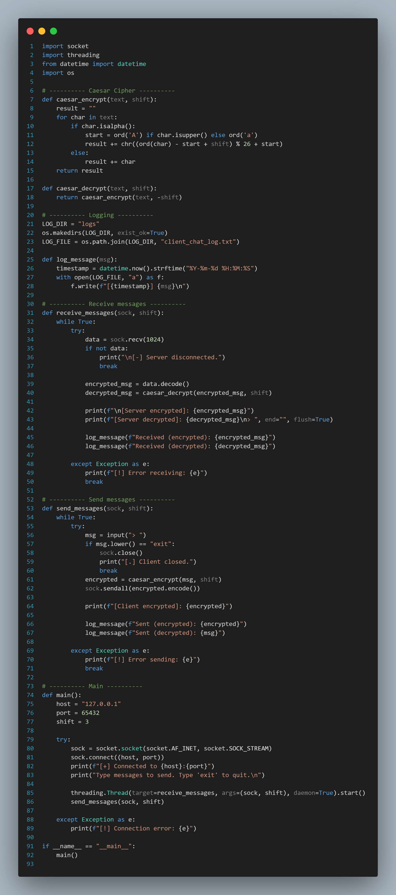
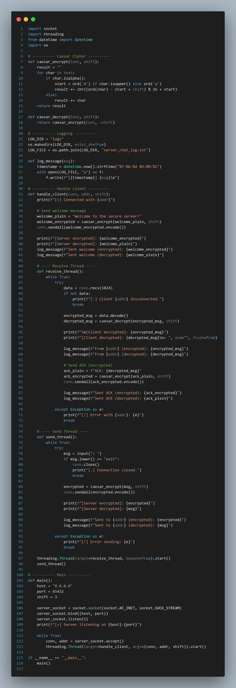

# CLIENT_SERVER Architecture using C

This project demonstrates a simple **Client-Server communication system** implemented in the **C programming language**.  
It uses **socket programming** to enable message exchange between a client and a server, simulating real-world network communication.

---

# Project Structure

```
CLIENT_SERVER_architecture_using_C/
│
├── client/                  # Contains client-side source code
├── server/                  # Contains server-side source code
├── logs/                    # Contains log files and message records
│
├── client_chat_log.txt       # Stores client-server chat history
├── pclient.png               # Screenshot of client terminal
├── pserver.png               # Screenshot of server terminal
├── logc.png, logp.png        # Additional log visualizations
└── README.md                 # Project documentation
```

---

# Features

✅ Establishes two-way communication between client and server  
✅ Demonstrates socket creation, binding, listening, and accepting connections  
✅ Logs all messages to `client_chat_log.txt`  
✅ Includes screenshots for visualization  
✅ Simple, modular C code for easy understanding  

---

# Concepts Used

- Socket Programming (`socket()`, `bind()`, `listen()`, `accept()`, `connect()`)
- Data Transmission using `send()` and `recv()`
- File handling in C
- Client–Server model design

---

# How to Compile and Run

## Step 1 — Compile the server
 
gcc server/server.c -o server
 

## Step 2 — Compile the client
 
gcc client/client.c -o client
 

## Step 3 — Run the programs
Start the server first in one terminal:

./server


Then run the client in another terminal:

./client


Now you can send and receive messages between them 

---

## Screenshots

### Client Terminal


### Server Terminal


---

## Log Files

All message interactions are automatically saved to:
 
 logs/client_chat_log.txt
 
 These logs can be used for debugging or future analysis.

---

## Future Improvements

- Add multi-client support  
- Implement file transfer between client and server  
- Add encryption for secure message transmission  
- Create a GUI version using Python or C++  

---

## Author

**Uday Kumar M**  
📧 [udaykumarm.ai23@bmsce.ac.in]  
🌐 [https://github.com/UdayKumarM123](https://github.com/UdayKumarM123)

---

### 🏁 License
This project is open-source and free to use for educational or personal learning purposes.
